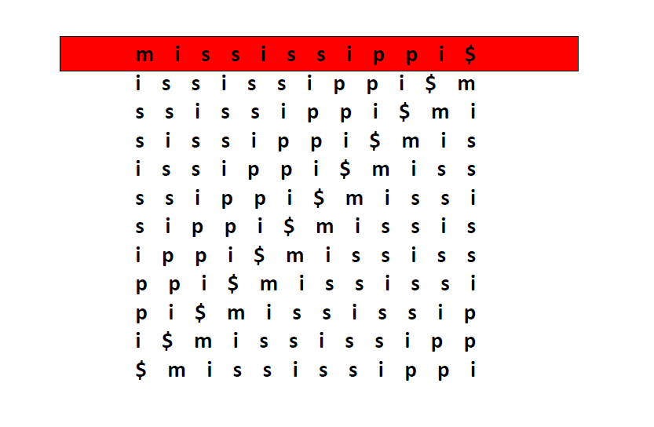
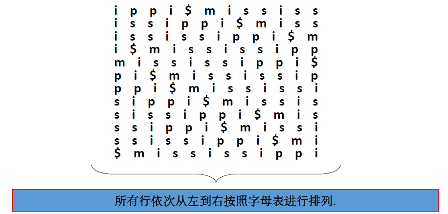
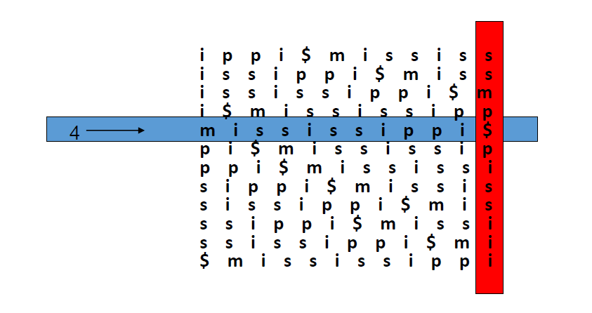
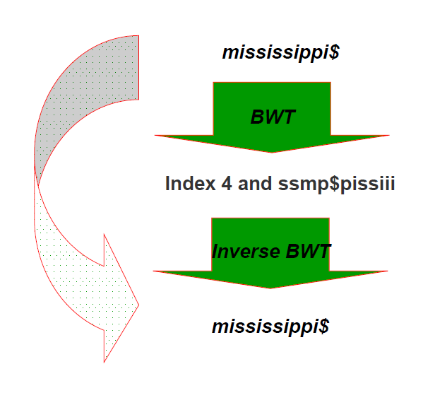
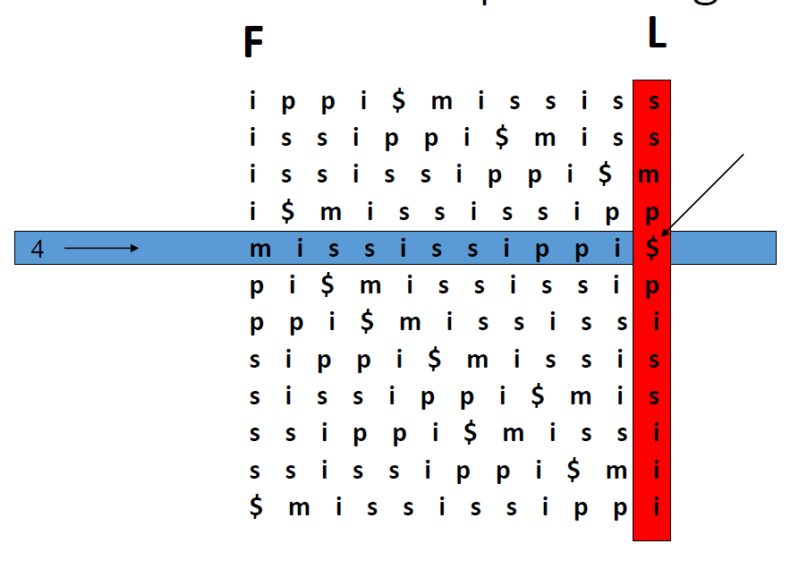
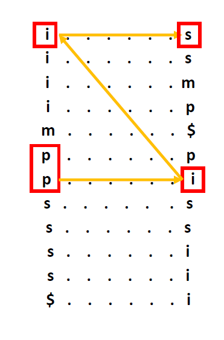

# BWT 实验报告

姓名：袁瑞

学号：170819

## 前言

Burrows and Wheeler transform(BWT)是一种分组排序无损变换，也是一种可逆的变换。1994年，Michale Burrows和David Wheeler提出该算法。BWT可以将文本转化为更适合压缩的序列，通常再转换后利用run-length-encoding(或者move-to-front)将局部性的数据整合，再结合哈夫曼编码可以得到比较好的压缩算法。

## 编码步骤

BWT编码算法主要分为三步。

1. 若现有一文本串，长度为N，则接连循环移位文本串N次，可得N*N的矩阵。其中每一行都是由上一行循环移位得到，第一行为原字符串。
2. 根据字母表顺序对矩阵进行排序
3. 将矩阵最后一列取出，即编码结果

### 前提假设

1. 假设现在文本字符由{a, b, c, ..., z}中元素组成
2. 假设字母表顺序如下
    * a < b < c < ... < $
3. 其中$作为结束字符

### 例子

现在有一文本串 T = mississippi

#### 步骤1 - 计算矩阵

1. 首先作循环移位，构建N*N矩阵 OM
2. 矩阵OM的第一行是原文本串, 即 OM[1, 1:N] = T。OM的剩余行都是连续循环左移上一行得到。
3. 得到矩阵OM如下

#### 步骤2 - 排序

将OM所有行按照升序排列，第一列是主序，第二列是次序，依次...得到排序后的矩阵如下

#### 步骤3 - 编码结果

排序后矩阵的最后一列的字符以及结束字符的行数就是编码结果，即 ssmp$pissiii

## BWT 解码步骤

BWT算法是个可逆的算法，即允许从最后一列字符和结束字符所在行数推导得出原数据，示意图如下

由于循环移位的关系，每一行的最后一个字符总是在第一个字符的前面。由此可以通过结束字符开始往前回溯，即得到前一个字符，直到还原出所有数据。事实上，编码结果是最后一列（即下图的L列），将其排序可以得到排序后矩阵的第一列（即下图的F列），我们可以通过这两列，还原出原始数据。

由上图可知，源字符串结束字符是$，由最后一列得知，$的前一个字符是字符i。那么字符i前面呢？F列中有四个i，哪一个才是我们需要的i呢？

这里需要介绍F-L映射，即如果某字符char在L中的所有相同char中排第j位，那么其对应的在F列中的char也是第j位。先看F列中的四个i, 这四个i后面的字符只有可能是p, s, s, m，而且这四个i的顺序是和p, s, s, m字符顺序是一样的，其本质上是一种枚举数据，即代表索引0, 1 , 2, 3。再来看F列中的四个i，根据上述分析，这四个i后面只有可能是p, s, s, m，并且顺序排列。而我们要寻找的i后面是m字符(即索引3)，那这个i必定是也是索引3上的i。根据LP映射，我们可以回溯得到数据为 mississippi

## 搜索

搜素其实也是一个回溯的过程，假设我们现在要搜索str="sip", 我们可以倒着开始匹配。那么从p开始回溯，F列中p有两个，那两个其实都有可能，这时候再来匹配倒数第二个字符，发现只有第二个p前面的字符是匹配的，再去匹配第三个字符...依次...如下图

## 优缺点

### 优点

BWT编码结果通常更适合压缩，因为它会将相同模式的字串聚集到一起，以便于局部数据处理。之后再利用run-length-encoding (或者move-to-front coding)方法。更重要得是，BWT可以快速的恢复出原字符串。

### 缺点

假设原字符串长度是N，由于排序的存在，所以复杂度比较高，对硬件不是很友好。

